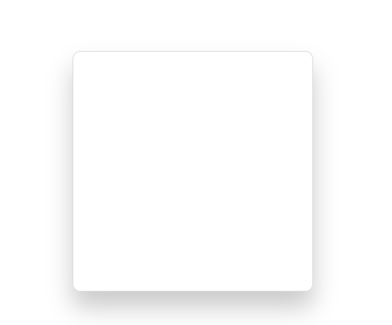
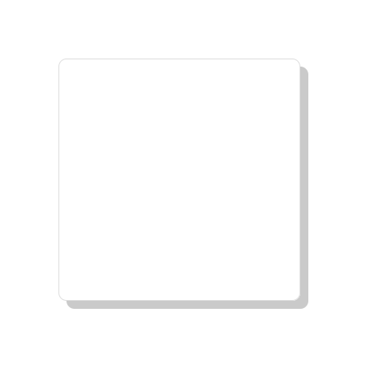
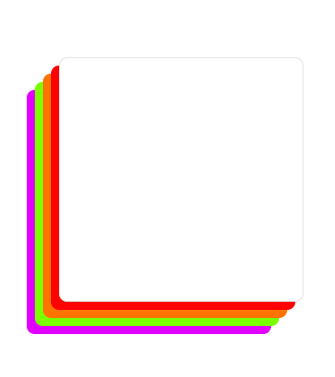

# CSS Box Shadows


Mini librería `CSS` de sombras que puedes utilizar en tus proyectos.

### Instalación

Por el momento no hay una versión instalable, aún esta en desarrollo.

Pero puedes clonar el repositorio.

```sh
$ git clone https://github.com/Franqsanz/css-box-shadows.git
```

### Modo de uso

La forma de utilizar esta librería es como cualquier archivo `CSS`. Solo debes enlazarlo en el `<head>`.

Ejemplo:

```HTML
<head>
  <link rel="stylesheet" href="./shadows.min.css">
</head>
```

**❗ ATENCIÓN ❗**

> Solo hay **clases** en está librería, no puedes usar `id`.

Entonces debes llamar los `class` desde las etiquetas que utilizes.
Por ejemplo un `<div>`.

### Color de la sombra

El mismo color en distintos tipos

- `#cacaca`
- `rgb(202, 202, 202)`
- `hsl(0, 0%, 79%)`

### Tipos de clases disponibles

- Clases con efecto `Blur`.
- Clases con efecto `Solid`.
- Clases con efecto `Multi Colors`.

#### Clases efecto `Blur`

Los números que contienen las clases hacen referencia a la cantidad de píxeles de `blur`.

Ejemplo:

```HTML
<div class="shadow-blur-30-botton"></div>
```



| Clases                  |
| ----------------------- |
| `shadow-blur-10-center` |
| `shadow-blur-10-left`   |
| `shadow-blur-10-right`  |
| `shadow-blur-10-top`    |
| `shadow-blur-10-botton` |
| `shadow-blur-20-center` |
| `shadow-blur-20-left`   |
| `shadow-blur-20-right`  |
| `shadow-blur-20-top`    |
| `shadow-blur-20-botton` |
| `shadow-blur-30-top`    |
| `shadow-blur-30-left`   |
| `shadow-blur-30-botton` |
| `shadow-blur-30-right`  |
| `shadow-blur-30-center` |
| `shadow-blur-40-center` |
| `shadow-blur-40-top`    |
| `shadow-blur-40-left`   |
| `shadow-blur-40-right`  |
| `shadow-blur-40-botton` |
| `shadow-blur-50-center` |
| `shadow-blur-50-top`    |
| `shadow-blur-50-left`   |
| `shadow-blur-50-right`  |
| `shadow-blur-50-botton` |

#### Clases efecto `Solid`

Los números que contienen las clases hacen referencia a la cantidad de píxeles de `Solid`.

Ejemplo:

```HTML
<div class="shadow-solid-10-right"></div>
```



| Clases                   |
| ------------------------ |
| `shadow-solid-10-center` |
| `shadow-solid-10-left`   |
| `shadow-solid-10-right`  |
| `shadow-solid-10-top`    |
| `shadow-solid-10-botton` |
| `shadow-solid-20-center` |
| `shadow-solid-20-left`   |
| `shadow-solid-20-right`  |
| `shadow-solid-20-top`    |
| `shadow-solid-20-botton` |

#### Clases efecto `Multi Colors`

Estás clases contienen varias capas de sombras multi colores _(Experimental)_.

Ejemplo:

```HTML
<div class="shadow-solid-multi-colors-left-botton"></div>
```



| Clases                                   |
| ---------------------------------------- |
| `shadow-solid-multi-colors-right-top`    |
| `shadow-solid-multi-colors-left-top`     |
| `shadow-solid-multi-colors-right-botton` |
| `shadow-solid-multi-colors-left-botton`  |
| `shadow-solid-multi-colors-top`          |
| `shadow-solid-multi-colors-botton`       |
